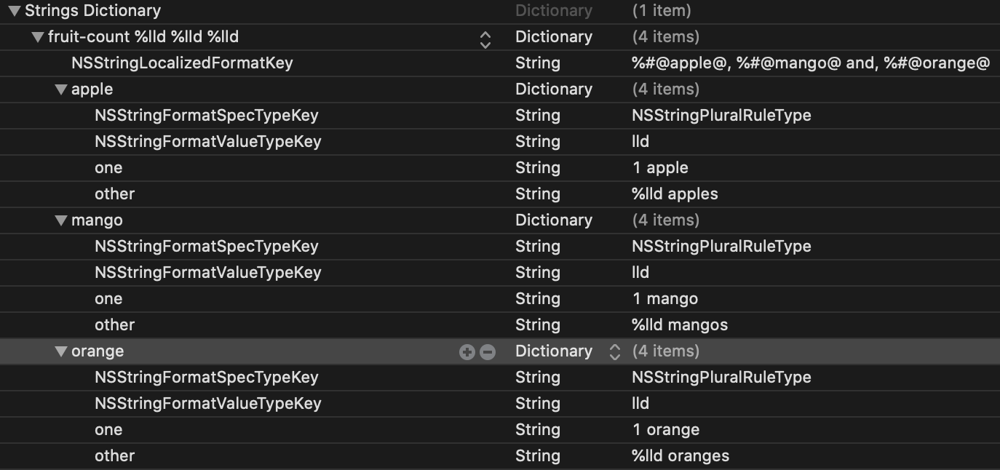

# SwiftUILocalization

Example created from this [tutorial](https://phrase.com/blog/posts/swiftui-tutorial-localization/).

**SwiftUI**
```
Text("hello-title")            
Text("title-name \(name)")            
Text("favourite-number \(favouriteNumber)")            
Text("fruit-count \(appleCount) \(mangoCount) \(orangeCount)", tableName: "Plurals")
```
- [ContentView.swift](SwiftUILocalization/ContentView.swift)


**Strings**
```
"hello-title" = "Hallo Welt!";
"title-name %@" = "Mein Name ist %@";
"favourite-number %lld" = "Meine Lieblingszahl ist 33 %lld";
```
- [Localizable.strings](SwiftUILocalization/de.lproj/Localizable.strings)

**Plurals**

- [Plurals.stringsdict](SwiftUILocalization/de.lproj/Plurals.stringsdict)